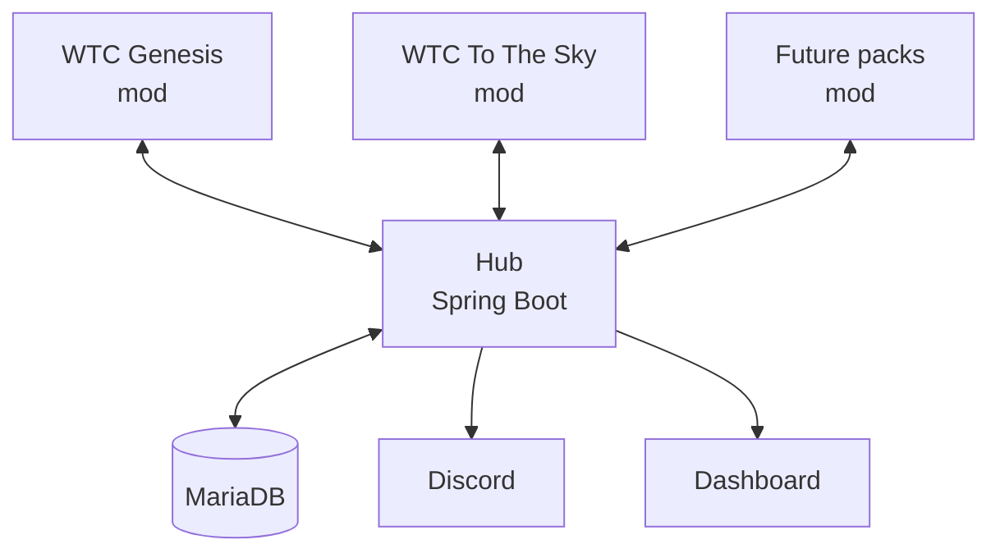

# WTC Lodestone

Cross-server integration for the **WTC Network**. A server-side NeoForge mod runs on each modpack server and connects to a central service (the **hub**), which powers network-wide presence, announcements, events, a staff dashboard and Discord integration.

> **Status:** early development (Phase 0 — project setup). See the [roadmap](docs/ROADMAP.md) for the full plan.

---

## How it works



- **Servers → hub:** events (player joins, boss kills, advancements, …).
- **Hub → servers:** commands (announcements, events, rewards) from a fixed allow-list.
- Servers never talk to each other directly, and keep working normally if the hub is offline.

---

## Repository structure

| Folder | What it is |
|---|---|
| `mod/` | Server-side NeoForge 1.21.1 mod (`wtc_lodestone`) |
| `hub/` | Spring Boot service: API, WebSocket, Discord, serves the dashboard |
| `hub/src/main/frontend/` | Dashboard (React + Vite + TypeScript), built into the hub jar |
| `deploy/` | Docker Compose files for local development and production |
| `docs/` | Roadmap and event/command catalog |

The mod and the hub are separate Gradle projects. They share no code, only the message format documented in `docs/`.

---

## Tech stack

- **Mod:** NeoForge 1.21.1, Java 21, ModDevGradle
- **Hub:** Spring Boot, Java 21, Spring Data JPA, Flyway, Spring Security
- **Database:** MariaDB
- **Dashboard:** React, Vite, TypeScript, ESLint
- **Infra:** Docker Compose, GitHub Actions

---

## Getting started

### Prerequisites

- JDK 21
- Node.js (LTS)
- MariaDB — via Docker Desktop, or installed locally

### 1. Database

With Docker:

```bash
docker compose -f deploy/docker-compose.dev.yml up -d
```

Without Docker, create the database and user manually:

```sql
CREATE DATABASE wtc_lodestone;
CREATE USER 'lodestone'@'localhost' IDENTIFIED BY 'lodestone';
GRANT ALL PRIVILEGES ON wtc_lodestone.* TO 'lodestone'@'localhost';
```

### 2. Hub

```bash
cd hub
./gradlew bootRun        # Windows: .\gradlew.bat bootRun
```

Runs on `http://localhost:8080`.

### 3. Dashboard (development)

```bash
cd hub/src/main/frontend
npm install
npm run dev
```

For production, the dashboard is built and packaged into the hub jar automatically.

### 4. Mod

```bash
cd mod
./gradlew runServer      # Windows: .\gradlew.bat runServer
```

On the first run, accept the EULA in `mod/runs/server/eula.txt` and run again.

---

## Mod configuration

Config file: `config/wtc_lodestone-common.toml` (in dev: `mod/runs/server/config/`).

| Option | Default | Description |
|---|---|---|
| `enabled` | `true` | Master switch |
| `dryRun` | `false` | Log events instead of sending them |
| `hubUrl` | `http://127.0.0.1:8080` | Hub base URL |
| `serverId` | *(empty)* | Unique id of this server, e.g. `genesis` |
| `token` | *(empty)* | Auth token generated by the hub — keep it secret |

The mod stays idle until `serverId` and `token` are set. It is **server-only**: players do not need it installed.

---

## Documentation

- Soon

---

## License

MIT — see [LICENSE](LICENSE).